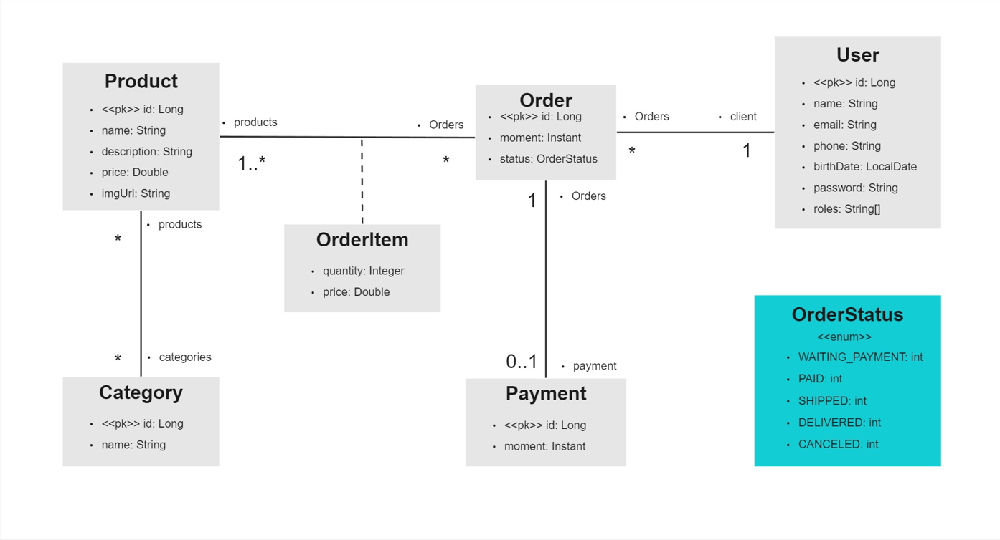
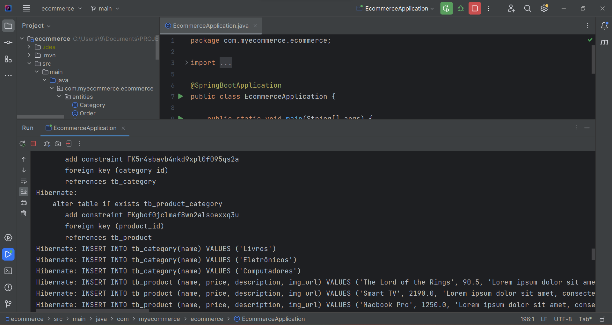
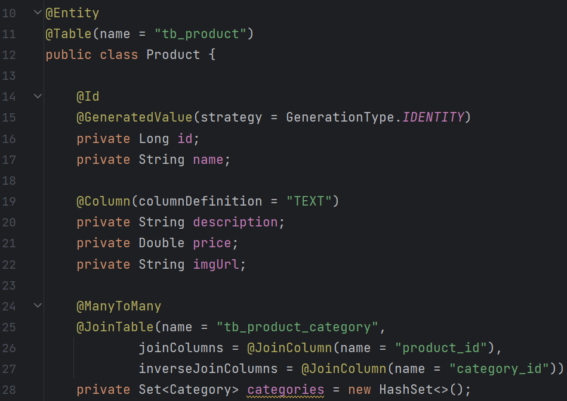

# E-Commerce System!

## An E-commerce System using Spring Data JPA!

In this project we are going to implement the following domain model using an ORM(Object Relational Mapping) tool:

&nbsp;  
This domain model is implemented in Spring using Spring Data JPA that simplifies database access and management in Spring applications, reducing the amount of standard code, providing a consistent and convenient way to interact with databases, and supporting multiple databases. In this case we use the H2 database.
&nbsp; 
&nbsp;  

|               SCREENSHOTS             
:------------------------------------------------:
 

&nbsp; 
&nbsp; 

Use ORM, or Object-Relational Mapping, simplifies the experience of interacting with a database by bridging the gap between the object-oriented programming world and the relational database world. It does so through the following key mechanisms:

- Abstraction of Database Operations
- Mapping between Objects and Tables
- Automatic SQL Generation

&nbsp;

&nbsp;

&nbsp;

As you can see, the data was correctly generated in the database and the Domain Model was successfully implemented.

## How to use? 🔌
1. Press the **Fork** button (top right the page) to save copy of this project on your account.

2. Download the repository files (project) from the download section or clone this project by typing in the git bash the following command:

       git clone https://github.com/lopesmfelipe/E-commerce-System.git
3. Run the application in an IDE that has dedicated spring support such as Intellj, Eclipse, Netbeans.
 
4. You can also modify this project as you want.

## Contributing 💡
If you want to contribute to this project and make it better with new ideas, your pull request is very welcomed.
If you find any issue just put it in the repository issue section, let's code!

## Thank You
Please ⭐️ this repo and share it with others!

